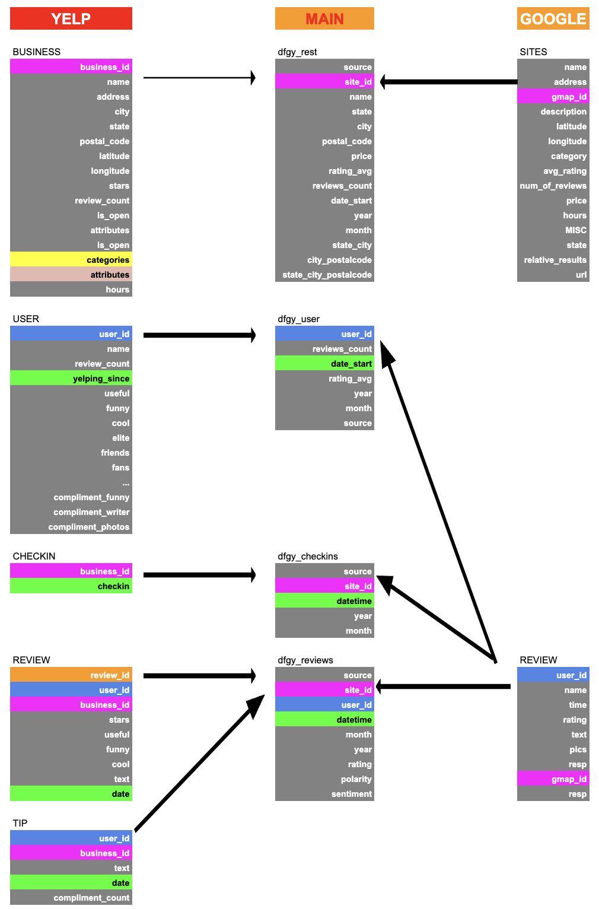
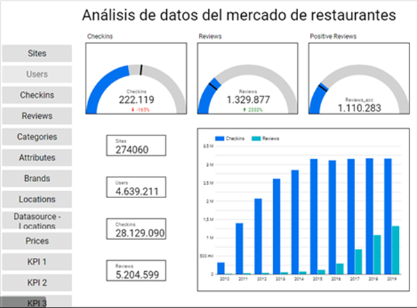
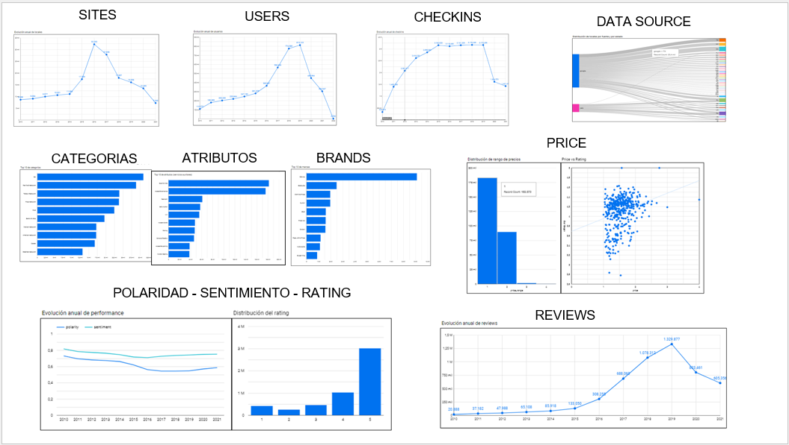
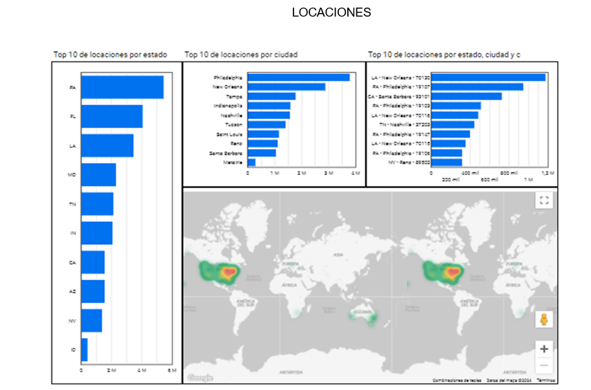

# DS_ProjectFinal

##  Contexto general del trabajo

El trabajo constituye una propuesta real de solución a un problema real de la industria. En particular, se define un sistema de recomendación como producto final que utiliza técnicas de machine learning. La industria a aplicar este sistema es el conjunto de restaurantes y bares de Estados Unidos. 

Se utilizará como información de entrada a los usuarios, locales y reseñas registradas en los datasets brindadados de YELP y GOOGLE. Se apunta a un tipo de cliente que tiene un perfil de propietario y/o directivo de restaurantes y bares, cuyo interés es obtener información clave sobre las tendencias e intereses de los clientes del sector, con el propósito de que ésta sirva como input para sus proyectos y estrategias que mejoren el desempeño de su marca.

## Contenidos y estructura
* Sprint 01. Puesta en Marcha: Definición del proyecto y análisis exploratorio de datos. Entregables: 
    * Charter del proyecto (incluye fundamentos del proyecto, stack tecnológico y flujo de trabajo, Alcance, objetivo, entregables)
    * EDA (Exploratory Data Analysis)
* Sprint 02. Data Engineeering: Implementación de estructura de datos. Entregables: 
    * Reporte de Data Engineering y producto Machine Learning
* Sprint 03. Data Analytics & Machine Learning: Desarrollo final de la herramienta de análisis de la información y el producto de Machine Learning. Entregables:
    * Dashboard final
    * Producto ML

## Resumen de Sprint 01
Durante el primer sprint, se definen las bases del proyecto y se realiza el análisis exploratorio de datos. Este análisis nos permitirá conocer las bases del mercado en cuestión, conocer las principales características de oferta y demanda, así como las preferencias del usuario. Asimismo, nos traerá una idea para definir los siguientes puntos:

* Objetivo del proyecto
* Alcance del proyecto
* Solución Propuesta
* Estructura, duración y entregables
* Stack tecnológico
* Datasets a utilizar

Para la realización del EDA, se realiza en forma previa la fase de ETL (Extraction, transformation and loading of data). Debido a la gran cantidad de información y necesidad de procesamiento, el ETL se realiza en forma separada con los siguientes archivos:
* DS_PjFinal_yelp1_sites_checkins_users
* DS_PjFinal_yelp2_reviews
* DS_PjFinal_google1_sites
* DS_PjFinal_google2_reviews
* DS_PjFinal_ETL_SitesUniques
	
La estructura general y contenido propuesto para cada parte del EDA consiste en:
* Importación de librerías
* Carga de datos
* Pre-procesamiento de datos: gestión de tipos de datos, valores duplicados y nulos, gestión de características
* Análisis de datos: incluye series de tiempo, distribuciones y formatos diversos para analizar la evolución a través del tiempo de características
* Conclusiones

Entregables del Sprint 01:
* Project Charter: describe el contexto general del proyecto, e incluye:
    * Metodología de trabajo
    * Alcance y objetivos
    * KPIs
    * Esquema de trabajo
    * Stack tecnológico
* EDA (Exploratory Data Analysis) o Análisis exploratorio de datos

Estructura de datos simplificada

Estrucura de datos completa

## Resumen de Sprint 02
Esta etapa consiste en la instalación, adecuación y desarrollo de una infraestructura de datos en un Data Warehouse. El proceso de ETL se presenta a través de un pipeline que contempla la carga incremental de datos. La plataforma seleccionada para esta tarea es Google Cloud Platform, en donde se utilizan los servicios de:
* Cloud storage
* Conexión a APIs
* Big query
* Data analysis

Se presenta una estructura propuesta de entidad-relaciones entre las tablas utilizadas, y asimismo un diccionario de datos. Estos formatos están sujetos a cambios si así lo requieren en el futuro, y constituyen la base para el producto final de dashboard a presentar en el Sprint 3.

Luego se presenta la estructura del datawarehouse en donde se muestran los procesamientos y las fases de estos procesos. Estos diagramas consisten en el centro del sprint en cuestión, pues proporcionana los detalles para el entendimiento del flujo de información. La transformación de datos se ha dividido en dos fases, contemplando los siguientes puntos:

* La capacidad de procesamiento del dataset completo antes de pasar por las transformaciones. 
* La reducción de costos de infraestructura en la nube (Google Cloud). 
* La capacidad para poder realizar cambios a la transformación de los datos preprocesados, sin la necesidad de que vuelvan a pasar por todo el proceso de limpieza.

Finalmente se presenta un MVP para el producto de machine learning. El mismo consiste en un sistema de recomendación de restaurantes basado en la comparaciòn de las reseñas de un usuario con las de los otros usuarios registrados en el sistema. Mediante tècnicas de Machine Learning, determina cuales son los usuarios con gustos más parecidos, y en base a esta similitud le recomienda uno (o mas restaurantes) de cualquier categorìa o de sòlo una categorìa especificada por el usuario. El sistema contempla el ingreso de inputs por parte del cliente y la obtención de outputs. A través de la selección de sus preferencias, el cliente obtiene una recomendación de restaurantes basado en las mismas. Las herramientas para su desarrollo han sido Scikit-Learn, NLKT, Fuzzywuzzy, y Streamlit.

Entregables del Sprint 02:
* Reporte de Data Engineering

## Resumen de Sprint 03
En el desarrollo del tercer y último sprint del Proyecto, se resolvieron los entregables finales del proyecto, cumpliendo con los hitos establecidos en el esquema inicial de Trello, a saber:
* Diseño del Dashboard
* Diseño de Reportes
* Diseño de StoryTelling
* Producto ML
* Ajustes al modelo
* Entregable Final
* Documentación
* DEMO 3

###  Dashboard
El entregable dashboard se encuentra actualizado con los datos que reposan en el Bigg Query de la nube:
La primera página es un resumen del proyecto, que incluye las conclusiones más importantes del mismo, que son los KPI con vista de velocímetro en la parte superior, que permite una lectura rápida de la situación. Se encuentra alojado en Looker, en el siguiente Link:

https://lookerstudio.google.com/reporting/d89b639c-7877-4d8b-94d9-312b5c177cd2/page/p_6bmjritshd

De los servicios más útiles que prestará la consultoría realizada por SMART CHOICE ANALYTICS es la definición, cálculo y análisis de los indicadores de gestión,  ya que siempre se diseñarán con la metodología SMART; serán específicos, medibles, alcanzables y con un tiempo definido.

Para este caso en particular, los KPI definidos son:

* KPI1 - Checkins:  Aumentar en 5% los checkins respecto al mismo período del año anterior.
  

* KPI2- Reviews:  Aumentar en un 20% las reviews acumuladas con respecto al mismo período del año anterior

	
* KPI3 – Positive Reviews:  Superar el millón de reviews acumuladas positivas en el último quarter.

También se presenta en la primera página del dashoard la gráfica que compara el progreso de los checkins y los reviews, evidenciando que desde el 2011 se cuenta con la información de las referencias de los usuarios que aumentan significativamente año a año, y que hasta el año 2019 refiere que, alrededor del 30% de los visitantes, incluyen sus reseña en la aplicación.

Al costado izquierdo, se observa el resúmen de la información existente en el Big Query, lo que da una puena perspectiva del análisis general que se visualiza en el Dashboard. 
Finalmente, en el margen izquierdom se pueden observar los enlaces que analizan los datos particulares de la data así:

Fnalmente, el último enlace del dashboard, dirige a la página donde se analizan las locaciones ralacionadas con el análisis que en ese momento se este desarrollando con el cliente así:

### Machine Learning (MVP)
#### Sistema de Recomendación de Restaurantes

*Principio de Funcionamiento*

El Sistema se basa la comparaciòn de las reseñas de un usuario con las de los otros usuarios registrados en el sistema y, mediante tècnicas de Machine Learning, determina cuales son los usuarios con gustos más parecidos, y en base a esta similitud le recomienda uno (o mas restaurantes) de cualquier categorìa o de sòlo una categorìa especificada por el usuario.

*Herramientas de Desarrollo*

El algoritmo de recomendación se desarrolló en Python utilizando la biblioteca open-source de Machine Learning Scikit-learn, y principalmente hace uso de dos de sus funciones TfidfVectorizer y Cosine_similarity. Adicionalmente, se utilizaron las bibliotecas de Python NLTK/SentimentIntensityAnalyzer para el análisis de sentimientos de las reseñas y fuzzywuzzy para la homologaciòn de las categorías, y finalmente Streamlit para el desarrollo de la la interfaz web interactiva.

-Scikit-learn 

-TfidfVectorizer: se utilizó para el procesamiento de lenguaje natural (NLP) para transformar el texto de las reseñas en vectores nùmericos que fueron utilizadas en el algoritmo de similitud.

-Cosine_similarity: se utilizó para calcular la similitud (mediante el algoritmo de la similitud del coseno) entre todos los vectores numéricos que representan las reseñas de los usuarios.

-NLTK (Natural Language Toolkit)

-SentimentIntensityAnalyzer: se utilizó para evaluar el tono emocional de las reseñas y obtener una puntuación de sentimiento que refleja la positividad, negatividad, neutralidad del sentimiento expresado en las reseñas.

-Fuzzywuzzy: se utilizó para comparar las categorías de ambos set de datos, Google y Yelp, y obtener una puntuación de similitud que va del 0% al 100%, donde una puntuación del 100% indica que las cadenas son idénticas; esto se hizo para generar un listado reducido y estandarizado de categorías 

-Streamlit: se utilizó para crear interfaz web interactiva que permite el ingreso de los datos y las selecciones de los usuarios y mostrar el resultado del sistema de recomendaciòn  

*Datos de Entrada*:
El sistema permite al usuario ingresar y seleccionar los siguientes paramètros para pedir la recomendación:
1. Identificador ùnico del usuario en la base de datos
2. El número de recomendaciones que desea - Disponible: de 1 al 10
3. El estado donde desea la recomendaciòn - Disponible: todos los estados de Estados Unidos 
4. La categoría de restaurantes en la que desea la recomendaciòn - Disponible: todas las categorías y la opción All (recomienda sin discriminar la categorìa)     

*Datos de Salida*:
1. Nombre(s) de restaurantes recomendados y para cada uno muestra:
La categoría del restaurante
Una reseña - imprime a manera de muestra la reseña que obtiene el mayor puntaje positivo obtenido con un algoritmo de anàlisis de sentimiento 
Rating - el puntaje otorgado al restaurante por el cliente que emitiò la reseña mostrada 

 

